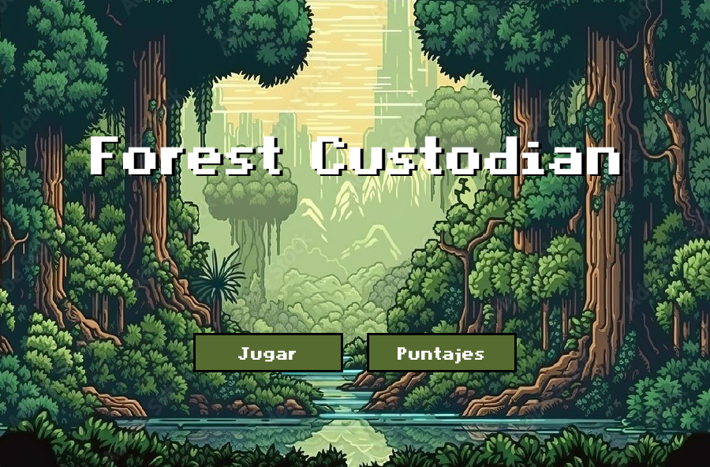
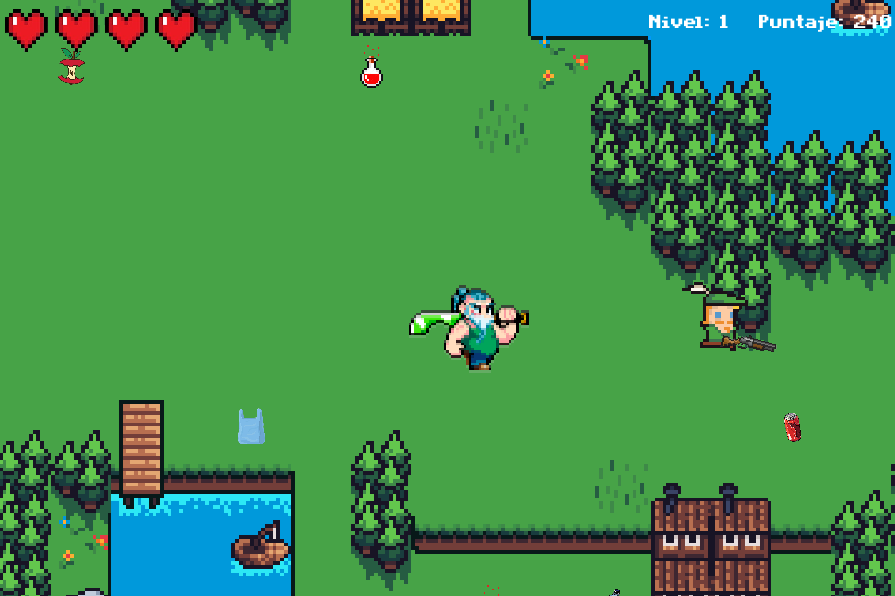
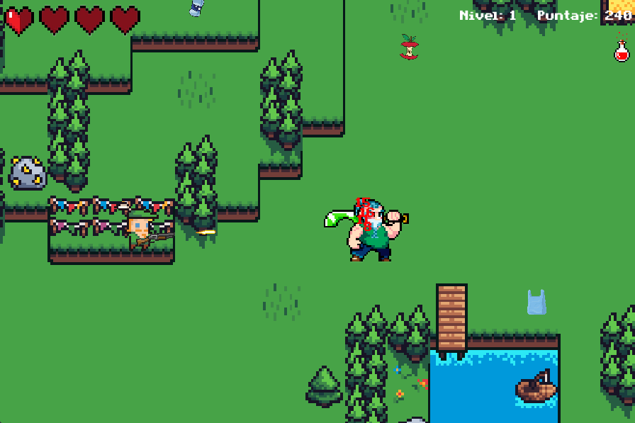
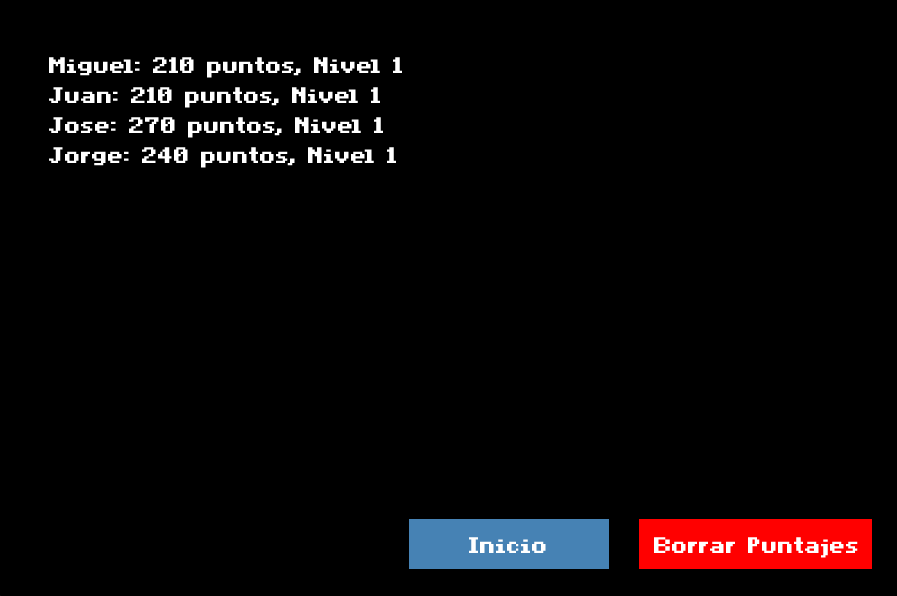

## Descripción

Forest Custodian es un videojuego educativo en 2D desarrollado con Python y Pygame. El propósito del juego es fomentar la conciencia ambiental a través de una experiencia interactiva centrada en la recolección de residuos, la protección de los bosques y la lucha contra amenazas simbólicas como enemigos y obstáculos.

El juego implementa una arquitectura modular dividida en paquetes funcionales: lógica del jugador, enemigos, entorno, interfaz gráfica y niveles. Utiliza animaciones 8-bit, sonido ambiental y una estructura de niveles que aumenta progresivamente en dificultad. Se ejecuta localmente sin dependencias externas, mediante un único punto de entrada (main.py).

Certificado mejor proyecto PPI T&T categoría primer semestre año 2024-1. 🏆






---

## Funcionalidades

| Módulo                 | Funcionalidad                                                                 |
|------------------------|------------------------------------------------------------------------------|
| main.py              | Punto de arranque. Controla bucle principal, inicialización y ventanas.      |
| codigo/personaje.py  | Movimiento del jugador, control de vida, animaciones, colisiones.            |
| codigo/weapon.py     | Lógica de disparo, animaciones de ataque, daño a enemigos.                   |
| codigo/items.py      | Recolección de objetos (basura, pociones), sistema de puntuación.            |
| codigo/mundo.py      | Generación del mapa, colisiones con el entorno, integración de capas.        |
| codigo/constantes.py | Configuraciones globales (tamaño pantalla, colores, frames por segundo).     |
| codigo/textos.py     | Cuadros de texto guía para el jugador.                                       |
| codigo/dividir_imagen.py | Utilidad para dividir spritesheet y asignar animaciones.                |
| ventanas/*.py        | Interfaces de inicio, game over, victoria, ventana final.                    |
| niveles/             | Escenarios y recursos visuales de cada fase del juego.                       |
| assets/              | Archivos de imagen, sonido, fuentes y puntuación persistente.                |

---

## Stack técnico y estructura del sistema

- *Lenguaje:* Python 3.x
- *Motor gráfico:* Pygame
- *Paradigma:* Programación estructurada modular
- *Recursos gráficos:* Sprites animados en estilo 8-bit
- *Fuentes personalizadas:* .ttf embebidas en assets/fonts/
- *Sistema de sonido:* Efectos .wav y música de fondo
- *Persistencia local:* Archivo puntajes.txt
- *Navegación entre escenas:* Manejo de ventanas desde ventanas/ sin framework externo
- *Organización modular:* Separación por responsabilidades (jugador, mundo, ítems, texto, armas)

## Instalación

Este proyecto no requiere instalación de dependencias adicionales. Solo se necesita tener Python 3.x y la biblioteca Pygame correctamente instalada.

1. Clonar el repositorio:
```bash
git clone https://github.com/miguelczz/ForestCustodian.git
cd ForestCustodian
```

3. Instalar Pygame:
```bash
pip install pygame
```

4. Ejecutar el archivo principal:
```bash
python main.py
```
